# 🎮 LFG Bot 🤖

###### LFG = "Looking For Group" or "Looking For Game"

> A Discord bot for organizing in-house 5v5 matches of Counter-Strike, Valorant, Overwatch, etc

One user starts a group, and 9 other users click the "join" button to be placed on a team.

Teams are shown in the bot's message, and can be shuffled by the group leader.

## Screenshots

**Startup Message**

**Empty Teams**

**Full Teams**

## Dev & Contributing

Project is open for contributions!

The bot is written in [Elixir](https://elixir-lang.org) and uses the [Nostrum](https://github.com/Kraigie/nostrum) library to interact with Discord.

The core data layer is using the [Ash](https://github.com/ash-project/ash) framework and is backed by a [PostgreSQL](https://www.postgresql.org) database (definitely overkill, but the official Ash SQLite integration wasn't available yet!).

The production instance is deployed on [Fly.io](https://fly.io).

  

    Things you'll need in order to contribute
  

- Elixir
  - [https://elixir-lang.org](https://elixir-lang.org)
  - I'm using version 1.15 with Erlang/OTP 26
- A PostgreSQL database
  - [https://www.postgresql.org](https://www.postgresql.org)
  - If you have docker, there's a `docker-compose` file in this repository which will run a dev database for you. Find it at [lfg_bot_pgsql/docker-compose.yml](lfg_bot_pgsql/docker-compose.yml)
- A Discord developer app for testing your changes locally
  - Learn about app development [here](https://discord.com/developers/docs/getting-started)
  - Create an app [here](https://discord.com/developers/applications?new_application=true)
- An environment variable on your system called `LFG_NOSTRUM_TOKEN`
  - Once you've made an app in the Discord developer portal (see section above), you can get your token from the settings page in the "Bot" section, under the "Build-A-Bot" header.
  - Copy the token and set yourself an environment variable named `LFG_NOSTRUM_TOKEN`
  - Keep your token secret!
- A Discord server for testing your changes
  - It's recommended to use a personal server for this, just in case
  - Once you've made an app in the Discord developer portal (see section above), you can add that bot to your server by:
    - Getting your client ID from the `OAuth2` section
    - Substituting your client ID in this URL: `https://discord.com/api/oauth2/authorize?client_id=<YOUR_CLIENT_ID_HERE>&permissions=53687158848&scope=bot`
      - (Permissions code last updated Oct 26 2023 // [permissions calculator](https://discordapi.com/permissions.html#53687158848))
    - Opening that URL in your browser

Unless I've missed something, after all this, you should be able to run the elixir application and interact with the bot in your testing server.

---

#### Repo Points of Interest

- [lib/lfg_bot/discord/consumer.ex](lfg_bot/lib/lfg_bot/discord/consumer.ex)
  - The module that listens for Discord events and sends them over to domain-specific handler functions
- [lib/lfg_bot/discord/interaction_handlers.ex](lfg_bot/lib/lfg_bot/discord/interaction_handlers.ex)
  - Handlers for [Discord Interactions](https://discord.com/developers/docs/interactions/receiving-and-responding#interactions) (button clicks etc)
- [lib/lfg_bot/discord/message_handlers.ex](lfg_bot/lib/lfg_bot/discord/message_handlers.ex)
  - Handlers for Discord messages
  <!-- TODO: write a section on the weird channel registration flow driven by a message handler -->
- [lib/lfg_bot/lfg_system/resources/registered_guild_channel.ex](lfg_bot/lib/lfg_bot/lfg_system/resources/registered_guild_channel.ex)
  - `RegisteredGuildChannel` database model
  - Represents a Discord server & channel wherein the bot can be controlled
- [lib/lfg_bot/lfg_system/resources/session.ex](lfg_bot/lib/lfg_bot/lfg_system/resources/session.ex)
  - `Session` database model
  - Represents a group/session and stores the team player lists

---

#### Diagrams

  

    Command installation flow

```mermaid
sequenceDiagram
autonumber

actor USER
participant DISCORD
participant CONSUMER
participant HANDLERS
participant DATABASE

Note right of CONSUMER: ⬇️🚨 ENTRY POINT ⬇️🚨
CONSUMER->>HANDLERS: {:READY,_,_}
HANDLERS->>DISCORD: Install commands
Note over DISCORD: CMD /lfginit installed! ✅
Note left of DISCORD: The bot is ready to be initialized.

```
  

  

    Channel registration flow
  

  

    Group setup flow

```mermaid
sequenceDiagram
autonumber

actor USER
participant DISCORD
participant CONSUMER
participant HANDLERS
participant DATABASE

USER--)CONSUMER: Click "New Group"
Note over CONSUMER: "LFGBOT_START_SESSION"
CONSUMER->>HANDLERS: InteractionHandlers<br />.start_session()
HANDLERS->>DISCORD: Send new session msg
Note over DISCORD: Temp group setup msg
Note left of DISCORD: We create the group msg with<br/>temp text so we can keep<br/>track of the msg ID in the Session<br/>database and edit it later.
DISCORD-->>HANDLERS: #nbsp;
Note left of HANDLERS: {msg_id}
HANDLERS->>DATABASE: create Session
Note over DATABASE: {guild_id, channel_id,<br />message_id, leader_user_id}
DATABASE-->>HANDLERS: #nbsp;
Note left of DATABASE: %Session{id: session_id}
Note left of DISCORD: Once the session is created, we edit<br />the setup msg to show the empty<br/>teams list, and add btns to <br />control the session.
Note left of DISCORD: Control btn components have the<br />session's ID associated with them<br/> in their custom_id field, so we can<br />pattern match on the session that each<br />event has come from.
HANDLERS-->>DISCORD: Edit msg - show teams, add components<br/>(bound to session_id)
HANDLERS-->>DISCORD: interaction response: ACK
Note left of DISCORD: ✅ Players can join,<br/>shuffle, end session
USER--)CONSUMER: Click "end session"
Note over CONSUMER: "LFGBOT_END_SESSION" <> session_id
CONSUMER->>HANDLERS: InteractionHandlers<br />.end_session()
HANDLERS->>DATABASE: change session state to :ended
HANDLERS->>DISCORD: delete session msg
HANDLERS->>DISCORD: interaction response: ACK
Note left of DISCORD: ✅ Session has<br />been cleaned up

```
  

  

    Player kick flow

```mermaid
sequenceDiagram
autonumber

actor USER
participant DISCORD
participant CONSUMER
participant HANDLERS
participant DATABASE

USER--)CONSUMER: Click "Kick a player"
Note over CONSUMER: "LFGBOT_KICK_INIT" <> session_id
CONSUMER->>HANDLERS: InteractionHandlers<br/>.initialize_player_kick()
Note over HANDLERS: {session_id}
HANDLERS-->>DISCORD: interaction response: Create msg
Note left of DISCORD: [Ephemeral msg]<br />Kick player components:<br/>Player select menu,<br/>kick btn (disabled)

USER--)CONSUMER: Select "player to kick"
Note over CONSUMER: "LFGBOT_KICK_SELECT" <> session_id
CONSUMER->>HANDLERS: InteractionHandlers<br/>.select_player_to_kick()
Note over HANDLERS: {session_id, user_id}
HANDLERS-->>DISCORD: interaction response:<br/>Update 'kick btn': bind user_id
Note left of DISCORD: [Ephemeral msg]<br />Kick player components:<br/>Player select menu,<br/>kick btn (ENABLED)

USER--)CONSUMER: Click 'kick'
Note over CONSUMER: "LFGBOT_KICK_SUBMIT" <> session_and_user_id
CONSUMER->>HANDLERS: InteractionHandlers<br/>.kick_player()
Note over HANDLERS: {session_id, user_id}
HANDLERS->>DATABASE: Remove player from session
DATABASE->>HANDLERS: #nbsp;
HANDLERS->>DISCORD: edit session msg<br />(show updated teams)
HANDLERS-->>DISCORD: interaction response: ACK
HANDLERS->>DISCORD: delete 'kick player' msg
Note left of DISCORD: ✅ Player kicked, and<br />temp message deleted

```
  

