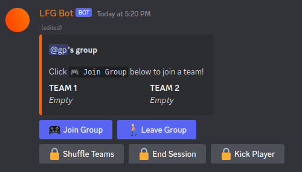

# 🎮 LFG Bot 🤖

###### LFG = "Looking For Group" or "Looking For Game"

> A Discord bot for organizing in-house 5v5 matches of Counter-Strike, Valorant, Overwatch, etc

One user starts a group, and 9 other users click the "join" button to be placed on a team.

Teams are shown in the bot's message, and can be shuffled by the group leader.

## Screenshots

**Startup Message**

**Empty Teams**

<!-- **Full Teams** -->
<!-- Add this pic later -->
<!--  -->
