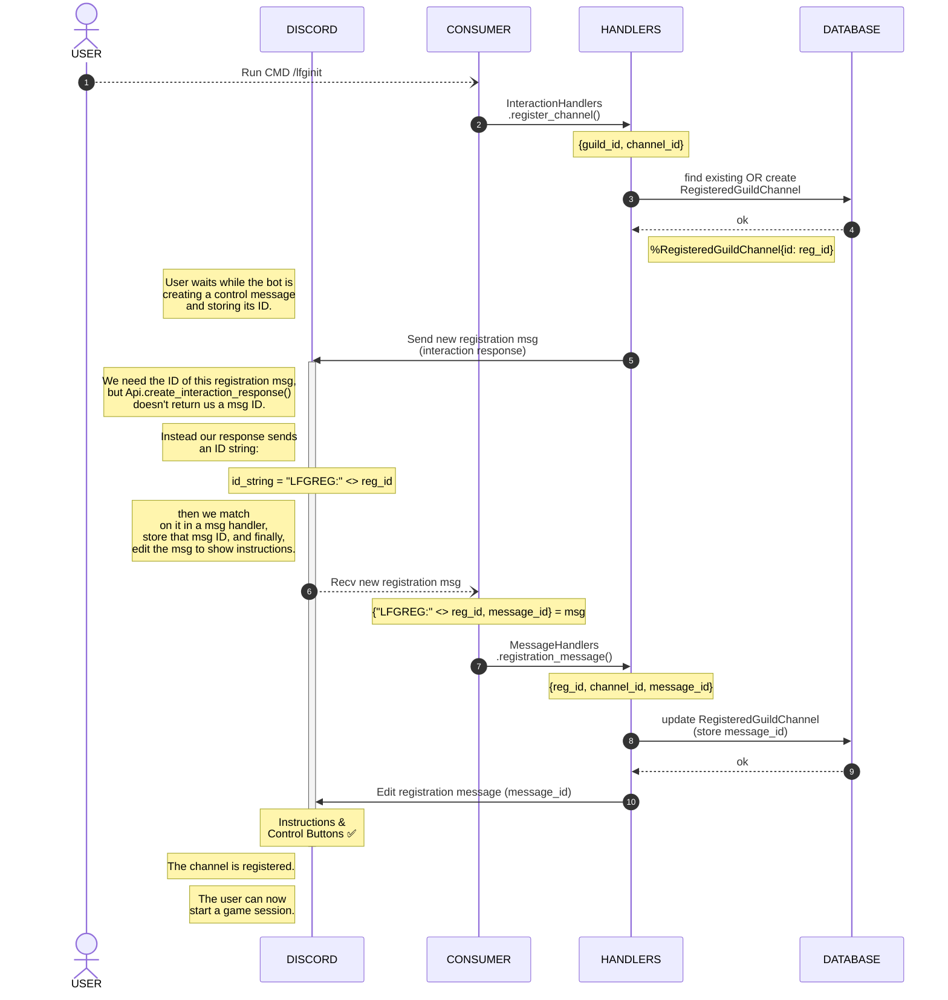

# Channel Registration Sequence

> [!NOTE]
> This diagram illustrates how we register a Discord channel with the bot.
> 
> The registration process creates a 'control message' in the channel - a persistent message containing usage instructions and a button to create a new group.
> 
> All registration message IDs are stored alongside their guild ID in the database, so if we ever need to change the usage instructions or 'create group' button's functionality, it's possible to send discord `edit message` commands to update them no matter what server or channel they're in.
> 
> We take precautions to only register a channel once, so we don't end up with more than one control message, even if the registration command is run again.

