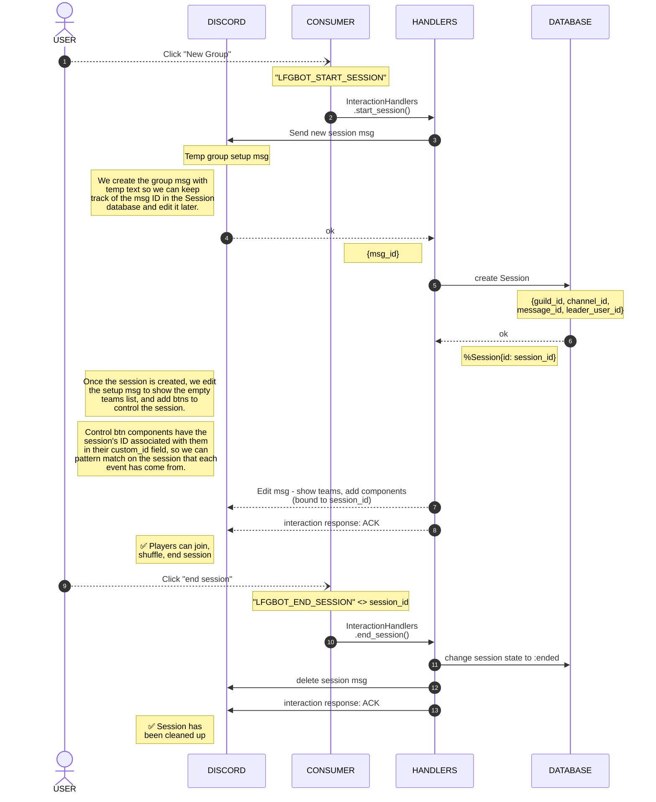

# Group Setup Sequence

> [!NOTE]
> This diagram illustrates how we create and run a game session.
> 

```mermaid
sequenceDiagram
autonumber
actor USER

participant DISCORD
participant CONSUMER
participant HANDLERS
participant DATABASE

USER--)CONSUMER: Click "New Group"
Note over CONSUMER: "LFGBOT_START_SESSION"
CONSUMER->>HANDLERS: InteractionHandlers<br />.start_session()
HANDLERS->>DISCORD: Send new session msg
Note over DISCORD: Temp group setup msg
Note left of DISCORD: We create the group msg with<br/>temp text so we can keep<br/>track of the msg ID in the Session<br/>database and edit it later.
DISCORD-->>HANDLERS: ok
Note left of HANDLERS: {msg_id}
HANDLERS->>DATABASE: create Session
Note over DATABASE: {guild_id, channel_id,<br />message_id, leader_user_id}
DATABASE-->>HANDLERS: ok
Note left of DATABASE: %Session{id: session_id}
Note left of DISCORD: Once the session is created, we edit<br />the setup msg to show the empty<br/>teams list, and add btns to <br />control the session.
Note left of DISCORD: Control btn components have the<br />session's ID associated with them<br/> in their custom_id field, so we can<br />pattern match on the session that each<br />event has come from.
HANDLERS-->>DISCORD: Edit msg - show teams, add components<br/>(bound to session_id)
HANDLERS-->>DISCORD: interaction response: ACK
Note left of DISCORD: ✅ Players can join,<br/>shuffle, end session
USER--)CONSUMER: Click "end session"
Note over CONSUMER: "LFGBOT_END_SESSION" <> session_id
CONSUMER->>HANDLERS: InteractionHandlers<br />.end_session()
HANDLERS->>DATABASE: change session state to :ended
HANDLERS->>DISCORD: delete session msg
HANDLERS->>DISCORD: interaction response: ACK
Note left of DISCORD: ✅ Session has<br />been cleaned up
```
