# Player Kick Sequence

[🔙 Back to index README](../README.md#diagrams)

> [!NOTE] 
> This diagram illustrates how we can use Discord message components to kick a player from a group. 
> 
> We create a 'kick player' menu component only visible to the group leader, have them select a user to kick, then bind that user's ID to a new 'kick confirmation' button component. Once the confirmation button is clicked, we perform the operation and clean up the components and message.

```mermaid
sequenceDiagram
autonumber

actor USER
participant DISCORD
participant CONSUMER
participant HANDLERS
participant DATABASE

USER--)CONSUMER: Click "Kick a player"
Note over CONSUMER: "LFGBOT_KICK_INIT" <> session_id
CONSUMER->>HANDLERS: InteractionHandlers<br/>.initialize_player_kick()
Note over HANDLERS: {session_id}
HANDLERS-->>DISCORD: interaction response: Create msg
Note left of DISCORD: [Ephemeral msg]<br />Kick player components:<br/>Player select menu,<br/>kick btn (disabled)
USER--)CONSUMER: Select "player to kick"
Note over CONSUMER: "LFGBOT_KICK_SELECT" <> session_id
CONSUMER->>HANDLERS: InteractionHandlers<br/>.select_player_to_kick()
Note over HANDLERS: {session_id, player_to_kick_id}
HANDLERS-->>DISCORD: interaction response:<br/>Update 'kick btn': bind player_to_kick_id
Note left of DISCORD: [Ephemeral msg]<br />Kick player components:<br/>Player select menu,<br/>kick btn (ENABLED)
USER--)CONSUMER: Click 'kick'
Note over CONSUMER: "LFGBOT_KICK_SUBMIT" <> session_and_player_to_kick_id
CONSUMER->>HANDLERS: InteractionHandlers<br/>.kick_player()
Note over HANDLERS: {session_id, player_to_kick_id}
HANDLERS->>DATABASE: Remove player from session
DATABASE->>HANDLERS: ok
HANDLERS->>DISCORD: edit session msg<br />(show updated teams)
HANDLERS-->>DISCORD: interaction response: ACK
HANDLERS->>DISCORD: delete 'kick player' msg
Note left of DISCORD: ✅ Player kicked, and<br />temp message deleted
```

[🔙 Back to index README](../README.md#diagrams)
